## **子网业务安全访问控制**

### **概述**

通过此教学您可以在京东云完成基础的网络模型部署，一个负责对外的WEB层一个负责逻辑的APP层一个负责数据的DB层。其中WEB层只能与公网和APP层互通，APP层只能与WEB层和DB层互通，DB层只能与APP层互通。完成后可获得以下资源：

- 1个私有网络
- 3个子网
- 3个ACL

### **操作步骤**

#### **第一步：创建私有网络**

- 在左边栏餐单中依次点击网络->私有网络->私有网络，进入私有网络列表页，点击创建，弹出创建配置窗口。
- 根据需求选择的地域，填写名称，填写CIDR，点击创建即可获得1个私有网络。
- 本教程中将该私有网络的CIDR设置为10.0.0.0/16。

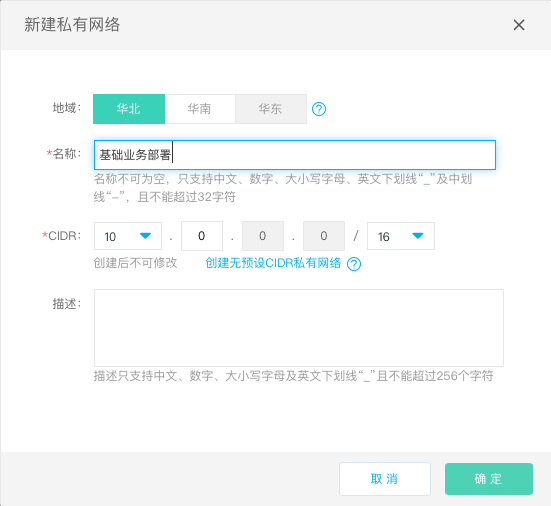

#### **第二步：创建子网WEB层、APP层、DB层子网**

- 在左边栏餐单中依次点击网络->私有网络->子网，进入子网列表页，点击创建，弹出创建配置窗口。
- 根据需求选择的地域，选择刚刚创建的私有网络，填写子网名称，填写子网CIDR，选择关联路由表，点击创建即可。重复三遍即可获得3个子网。
- 本教程中将WEB层子网CIDR设置为10.0.1.0/24，APP层子网CIDR设置为10.0.1.0/24，DB层子网CIDR设置为10.0.2.0/24。

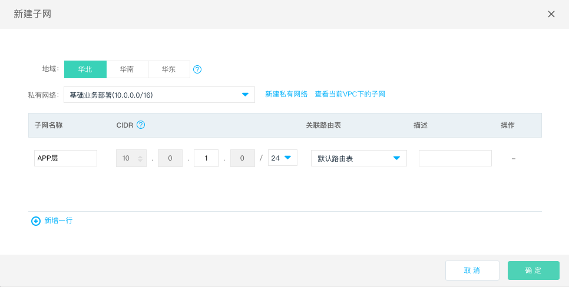

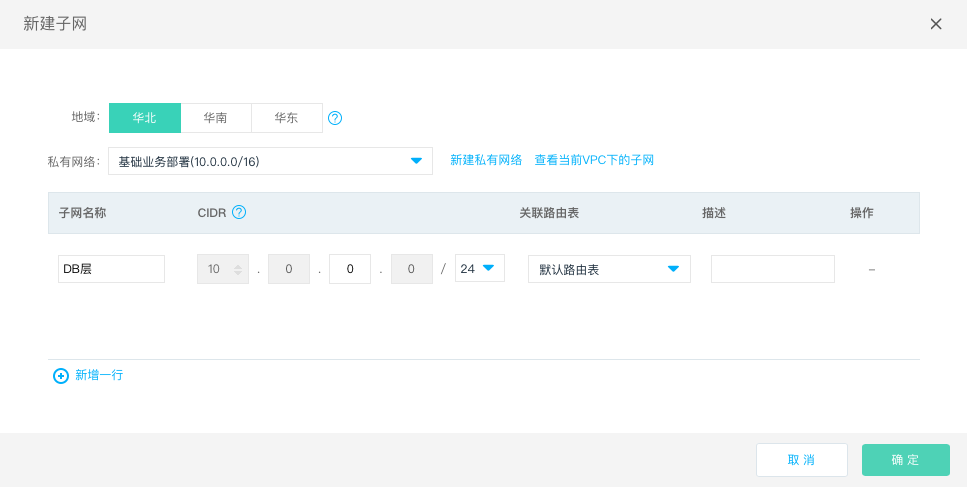

#### **第三步：配置并绑定ACL**

##### 创建ACL

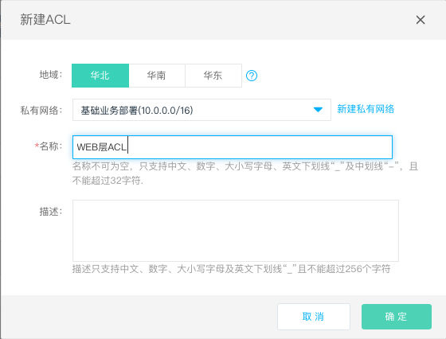

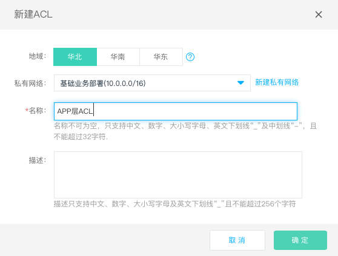

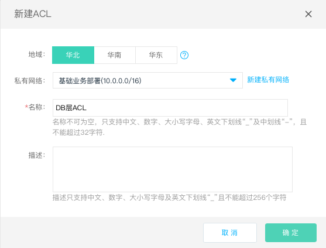

##### **WEB层ACL配置**

##### 配置入站规则

- 配置WEB层与APP层之间入站允许规则，将优先级设为200，类型设为ALL traffic，源IP设为10.0.1.0/24，策略设为接受。
- 配置WEB层与该VPC内其他网段之间入站拒绝规则，将优先级设为10000，类型设为ALL traffic，源IP设为10.0.0.0/16，策略设为拒绝。
- 配置WEB层与公网之间入站允许规则，将优先级设为20000，类型设为ALL traffic，源IP设为0.0.0.0/0，策略设为接受。

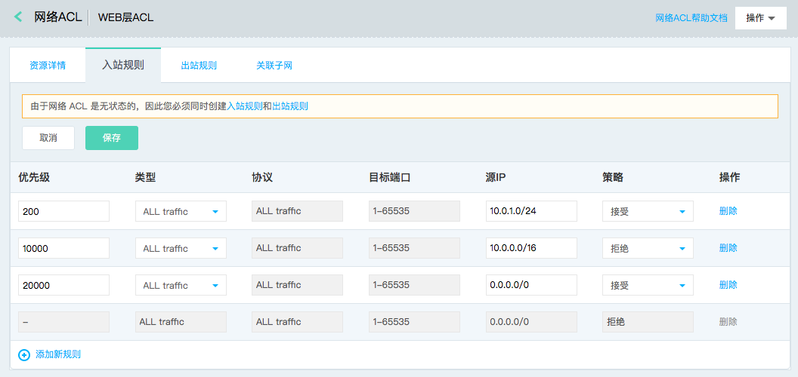

##### 配置出站规则

- 配置WEB层与APP层之间出站允许规则，将优先级设为200，类型设为ALL traffic，目的IP设为10.0.1.0/24，策略设为接受。
- 配置WEB层与该VPC内其他网段之间出站拒绝规则，将优先级设为10000，类型设为ALL traffic，目的IP设为10.0.0.0/16，策略设为拒绝。
- 配置WEB层与公网之间出站允许规则，将优先级设为20000，类型设为ALL traffic，目的IP设为0.0.0.0/0，策略设为接受。

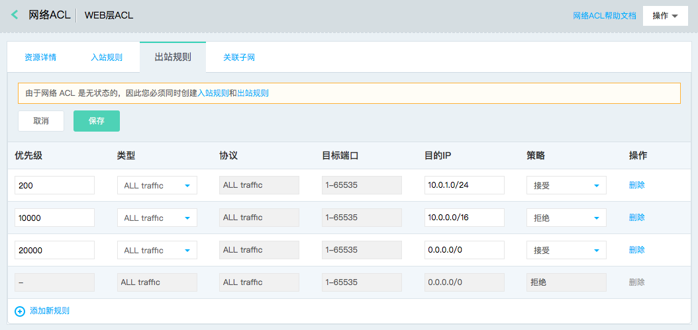

#### **配置关联子网**

- 点击关联子网TAB->关联子网按钮，打开关联子网配置弹窗。
- 选择WEB层子网，点击确定完成配置。

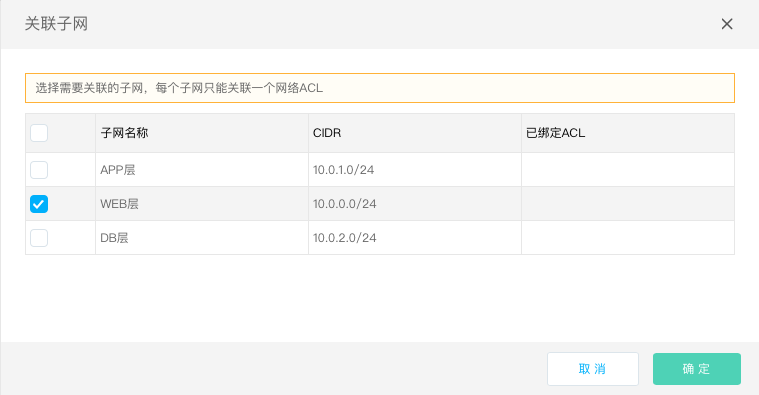

#### **APP层ACL配置**

##### 配置入站规则

- 配置APP层与WEB层之间入站允许规则，将优先级设为200，类型设为ALL traffic，源IP设为10.0.0.0/24，策略设为接受。
- 配置APP层与DB层之间入站允许规则，将优先级设为300，类型设为ALL traffic，源IP设为10.0.2.0/24，策略设为接受。
- 配置APP层与该VPC内其他网段之间入站拒绝规则，将优先级设为10000，类型设为ALL traffic，源IP设为10.0.0.0/16，策略设为拒绝。

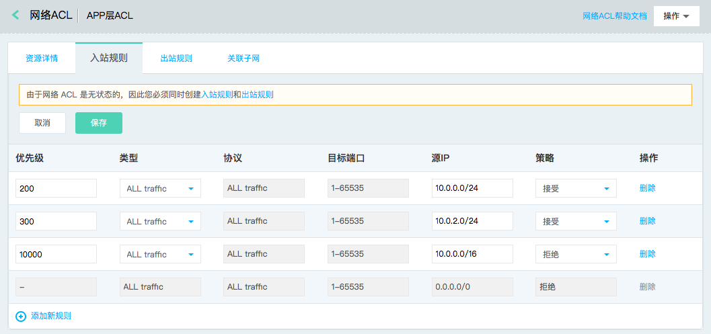

##### 配置出站规则

- 配置APP层与WEB层之间出站允许规则，将优先级设为200，类型设为ALL traffic，目的IP设为10.0.0.0/24，策略设为接受。
- 配置APP层与DB层之间出站允许规则，将优先级设为300，类型设为ALL traffic，目的IP设为10.0.2.0/24，策略设为接受。
- 配置APP层与该VPC内其他网段之间出站拒绝规则，将优先级设为10000，类型设为ALL traffic，目的IP设为10.0.0.0/16，策略设为拒绝。

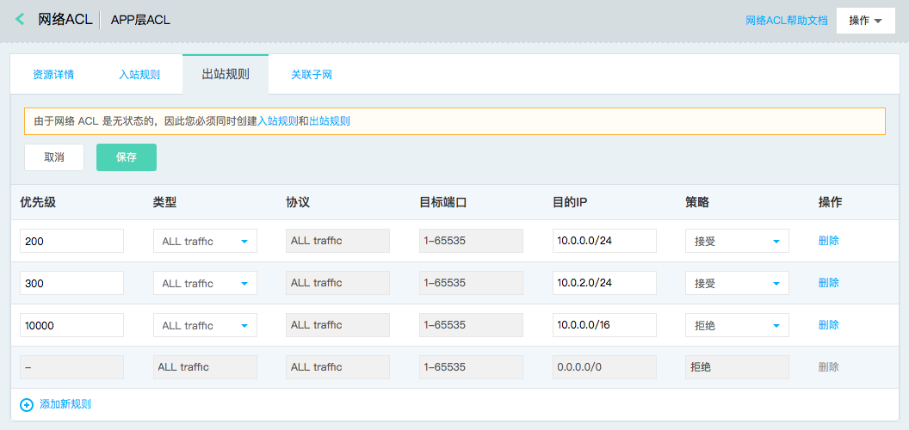

#### **配置关联子网**

- 点击关联子网TAB->关联子网按钮，打开关联子网配置弹窗。
- 选择APP层子网，点击确定完成配置。

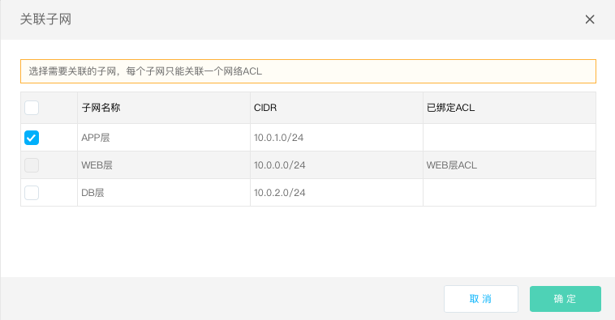

#### **DB层ACL配置**

##### 配置入站规则

- 配置DB层与APP层之间入站允许规则，将优先级设为200，类型设为ALL traffic，源IP设为10.0.1.0/24，策略设为接受。
- 配置DB层与该VPC内其他网段之间入站拒绝规则，将优先级设为10000，类型设为ALL traffic，源IP设为10.0.0.0/16，策略设为拒绝。

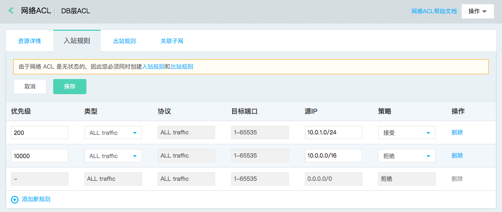

##### 配置出站规则

- 配置DB层与APP层之间出站允许规则，将优先级设为200，类型设为ALL traffic，目的IP设为10.0.1.0/24，策略设为接受。
- 配置DB层与该VPC内其他网段之间出站拒绝规则，将优先级设为10000，类型设为ALL traffic，目的IP设为10.0.0.0/16，策略设为拒绝。

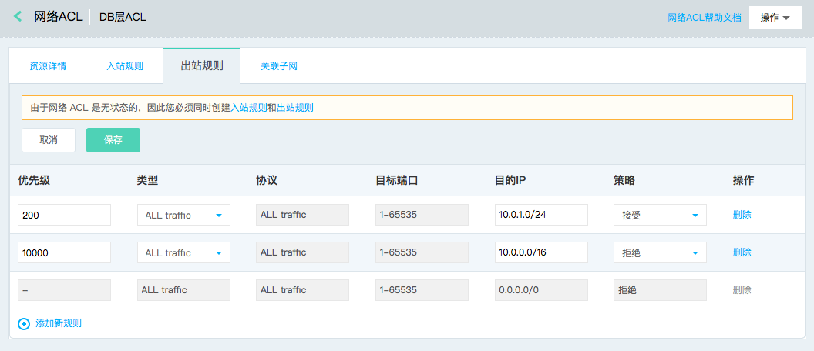

#### **配置关联子网**

- 点击关联子网TAB->关联子网按钮，打开关联子网配置弹窗。
- 选择DB层子网，点击确定完成配置。

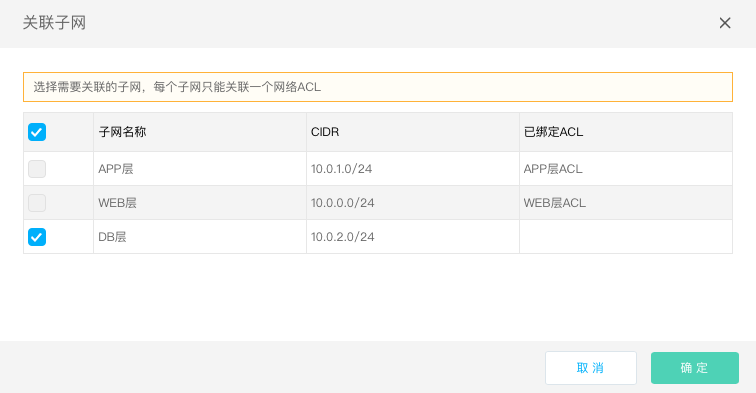