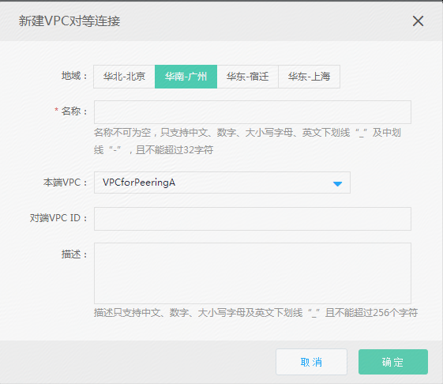
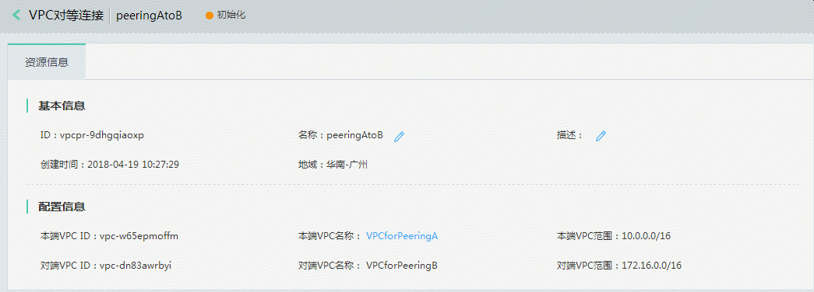
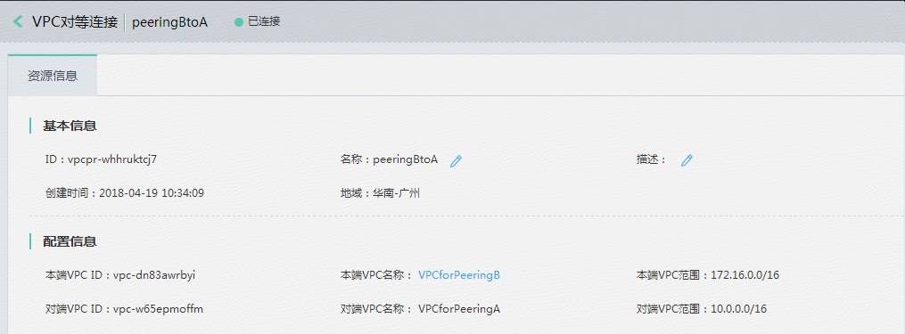
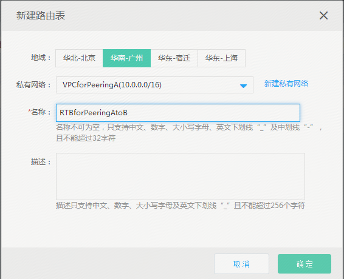

## **VPC对等连接**

**业务场景**

华南地区，两个VPC有通过内网IP的通信需求，详情如下：

- 本端VPC

- - 名称：VPCforPeeringA
  - ID：vpc-xxvpcforpeeringaxx
  - 范围：10.0.0.0/16

- 对端VPC

- - 名称：VPCforPeeringB
  - ID：vpc-xxvpcforpeeringbxx
  - 范围：172.16.0.0/16

**第一步：创建对等连接**

1) 登录控制台，在产品菜单的网络栏目中点击私有网络，然后在私有网络菜单中点击VPC对等连接，进入VPC对等连接列表页。

2) 在VPC对等连接列表页点击创建，打开创建VPC对等连接创建窗口。

3) 在VPC对等连接创建窗口中配置VPC对等连接相关信息，点击确定完成创建。弹窗将提示创建成功，请前往路由表配置相关路由！点击前往配置进入路由表列表页，点击稍后配置返回VPCpeering列表。配置信息如下

- 地域选择华南
- 名称填写peeringAtoB
- 本端VPC选择VPCforPeeringA
- 对端VPC ID填写vpc-xxvpcforpeeringbxx

4）对端私有网络中需使用同样的步骤创建连接VPCforPeeringA的VPC对等连接。

**第二步：为对等连接配置路由表**

1) 登录控制台，在产品菜单的网络栏目中点击私有网络，然后在私有网络菜单中点击路由表，进入路由表列表页。

 

2) 在路由表列表页点击创建，打开路由表创建弹窗。

3) 在路由表创建弹窗中配置路由表基本信息，点击确定完成创建。弹窗“显示创建路由表后需要配置路由策略，并关联子网才能生效。是否去配置？”，选择立即配置进入路由表详情页。

 

路由表配置信息如下：

- 地域选择华南
- 私有网络选择VPCforPeeringA
- 名称填写RTBforPeeringAtoB

4) 在路由表详情页中，点击路由策略tab，然后点击编辑，开启路由编辑模式，点击新增一条开始编辑新的路由条目。

5）在路由条目中填入相关配置，点击保存完成路由表编辑。路由条目配置如下：

 

- 目的端填写172.16.0.0/16
- 下一跳类型选择VPC对等连接
- 下一跳选择peeringAtoB
- 如果需要公网访问，还需要添加0.0.0.0/0到internet的路由规则。

6）配置完路由表需将路由表绑定至需要互通的子网，并在对端私有网络中需使用同样的步骤创建并配置路由表RTBforPeeringBtoA。

 

配置完成后两端VPC即可通过内网IP建立连接。