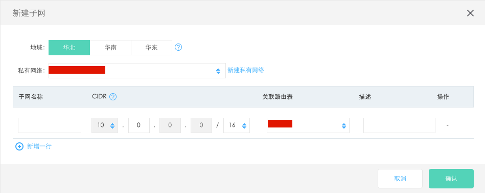
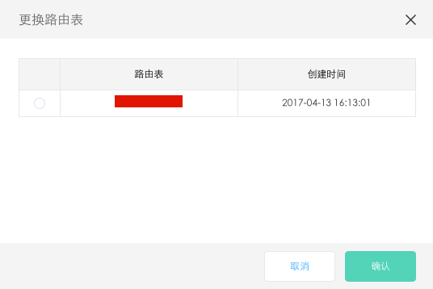

## **子网配置**

#### **步骤一、创建子网**

1.打开控制台，选择 网络 > 子网 ，进入子网列表页；

2.选择创建子网所属地域（目前开放华北、华南地域），点击“创建”按钮；

3.地域选择：在此步骤仍可以选择创建子网的地域，如果所选地域限额已满，可以通过“提交工单”提升限额；

4.选择所属私有网络，子网必须创建在某个私有网络内。

5.创建子网：支持同时创建多个子网，输入子网名称、子网CIDR、关联的路由表、描述等信息。

6.子网的CIDR只能是内网网段，可选范围为10.0.0.0(掩码为16~28)、172.16.0.0~172.31.0.0(掩码为16~28)、192.168.0.0(掩码为16~28)。

7.多个子网的CIDR之间不可重叠，若所属私有网络已预设了CIDR，则子网的CIDR不能超过私有网络的边界。

8.设置子网名称：名称不可为空，只支持中文、数字、大小写字母、英文下划线“_”及中划线“-”，且不能超过32字符；

9.选择子网关联的路由表，每个子网能够关联一张路由表，且必须关联一张路由表。

10.设置子网描述：描述可以为空，只支持中文、数字、大小写字母、英文下划线“_”及中划线“-”，且不能超过256字符；

11.点击【确定】后即可进入“控制台”查看创建的子网；

#### **步骤二、更换路由表**

1.打开控制台，选择 网络 > 子网 ，进入子网列表页；

2.点击操作列的“更换路由表”；

3.在弹出的路由表选择页面，选择要为该子网更换的路由表，可为该子网更换所属私有网络中的其他路由表；

4.点击【确定】后即可为子网更换路由表；

#### **步骤三、修改子网名称/描述**

1.打开控制台，选择 网络 > 子网 ，点击子网名称进入子网详情页；

2.点击名称/描述后的修改按钮，即可对子网名称/描述进行修改，具体的名称/描述规则参见子网创建；

#### **步骤四、查看子网内路由表规则、ACL规则、云主机**

打开控制台，选择 网络 > 子网，点击子网名称进入子网详情页，切换路由规则、ACL规则、云主机的tab即可查看。

 

#### **步骤五、删除子网**

1.打开控制台，选择 网络 > 子网 ，进入子网列表页；

2.点击操作列的删除；

3.二次确认删除子网后，即可删除该子网；

4.删除子网的限制：创建了资源的子网不可删除，如在该子网中创建了云主机、负载均衡等。

 